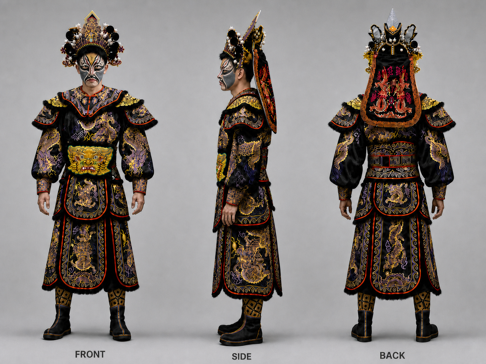

<div align="center">

# Visual Asset Hub

**让角色保持真实，让创作持续积累。**

Character · Photography · Prompt

与 Codex 协作的视觉资产与创作实践库

[浏览资产](ASSETS_INDEX.md) · [生成记录](GENERATION_LOG.md) · [案例模板](topics/_case-template/README.md) · [贡献指南](CONTRIBUTING.md)

</div>

---

Visual Asset Hub 面向 AI 图像创作与后续视频制作，将人物、服装、脸谱、摄影参考与生成实验组织为可长期复用的创作资料。项目以 **Codex 对话与内置图像生成能力**为创作入口，通过参考图、提示词和持续反馈，探索角色一致性与摄影场景融合。

| 角色一致性 | 摄影可信度 | 经验可复用 |
|---|---|---|
| 保持人物身份、身体比例与服装设计，让角色在不同画面中延续 | 让姿态、透视、光影与材质共同成立，形成可信的现场感 | 将素材、完整提示词、修改过程和采用理由留在具体案例中 |

## 资产预览



*主线资产 · man_b · AI 人物服装三视图。展示现有资产形式；设计细节以实拍核对与创作者确认为依据。*

资产库已收录 huibin 人物素材、四套服装、yingge_001 脸谱与 17 张意境参考。资产来源、版本和待确认项统一在 [ASSETS_INDEX.md](ASSETS_INDEX.md) 维护。

## 与 Codex 一起创作

图像生成与编辑统一通过 **Codex 内置图像生成能力**完成。创作者提供素材、表达意图并反馈结果，Codex 将这些信息组织成清晰的生成指令。本项目不接入其他生图 API，不要求本地显卡、模型部署或训练环境。

| 环节 | 创作者 | Codex |
|---|---|---|
| 确定目标 | 提供参考作品、人物素材、用途与审美方向 | 阅读素材，拆解构图、姿态、光影与关键细节 |
| 准备参考 | 确认角色设计、服装与脸谱组合 | 核对资产来源与版本，明确每张参考图的用途 |
| 生成图片 | 用自然语言说明期望与限制 | 整理提示词，通过内置能力生成或编辑图片 |
| 迭代修改 | 指出具体问题与取舍 | 对照基准检查，针对问题修改并复查保留项 |
| 确认与沉淀 | 决定是否采用、是否成为角色基准 | 在任务授权范围内保存版本、登记记录并归纳经验 |

### 从一次明确的创作请求开始

在 Codex 中打开本项目，提供或指定人物素材与摄影参考，说明用途、画幅和希望保留的角色特征。自然语言即可开始创作，无需预先掌握完整的摄影术语或提示词格式。

> 用这组人物和服装参考，生成一张角色进入这张摄影作品场景的图片。人物身份、头饰、脸谱和服装设计必须准确；背景与构图尽量保留，也可以调整为相似场景。请先看图，明确各张参考的用途，再通过 Codex 生成。结果需要检查人物细节、透视、光向与接触阴影。

如果本次仅需分析或提示词，应在请求中说明。角色设计变化与最终采用由创作者决定，场景成片不会自动替换角色基准。

## 当前实践：角色进入摄影场景

以摄影作品为构图、姿态与光影参考，先建立经过确认的人物及服装三视图，再通过 Codex 生成角色融入场景的图片，为后续镜头与视频创作积累可信的视觉素材。

**人物准确是采用前提；场景与构图在创作目标允许的范围内适配人物。**

| 阶段 | 要解决的问题 | 留下的依据 |
|---|---|---|
| 01 · 角色基准 | 正侧背是否属于同一设计，脸、服装、头饰与脸谱是否明确 | 选定的资产版本、关键细节与待确认内容 |
| 02 · 摄影拆解 | 参考作品的机位、动作、构图和光影如何成立 | 场景描述、参考图分工与允许变化的范围 |
| 03 · 生成探索 | 如何让角色在目标场景中保持身份与设计 | 实际使用的完整提示词、输入顺序与输出版本 |
| 04 · 定向修改 | 哪些局部不准确，怎样修改而不破坏已成立的部分 | 修改依据、所基于的版本与逐轮反馈 |
| 05 · 采用归档 | 结果是否满足人物、摄影与创作要求 | 人工决定、采用理由、失败原因与适用条件 |

三视图中由模型补出的未知细节属于设计候选，需经创作者确认。出现人物漂移时，回到较好的版本和原始参考重新处理。上述方法的稳定性需要通过实际案例积累验证。

## 提示词方法

提示词围绕 **参考分工、目标画面、保留特征、变化范围**组织。摄影语言用于说明可观察的画面关系：机位与景别、人物尺度与视线、主光方向与软硬、材质反应，以及人物与环境的接触。

| 方法 | 在创作中的用法 |
|---|---|
| 给参考图明确分工 | 指出哪张图决定身份，哪张决定服装，哪张只提供场景或光影 |
| 写清保留与变化 | 身份和设计保持一致，姿态、衣褶与受光按场景适配 |
| 一轮集中解决一个主要问题 | 指定修改基于哪个版本，并重申人物与构图的保留项 |
| 对照输出修正方法 | 学习优秀案例的表达，在自己的素材上验证，保留失败结果及修改原因 |

<details>
<summary><strong>查看场景生成提示词结构</strong></summary>

以下为起步结构，尚未经过本项目案例验证。使用时按实际输入调整图号与内容。

```text
任务：生成一张用于 <用途> 的摄影感角色场景图，画幅为 <比例>。

参考图分工：
- 图 1：已确认的角色面部参考，用于身份特征。
- 图 2：已确认的全身服装三视图，用于比例、服装与头饰结构。
- 图 3：本次指定的脸谱或服装细节参考，用于对应局部。
- 图 4：摄影场景参考，用于 <构图 / 姿态 / 光影>。

角色要求：
保持 <面部特征>、<身体比例>、<服装剪裁>、<关键纹样与配饰>。
按本次指定的脸谱与服装组合呈现，区分参考图中的不同造型。
人物姿态为 <动作>，视线朝向 <方向>，与 <道具或环境> 的接触关系为 <描述>。

场景与摄影：
采用 <景别与机位>，人物在画面中占 <位置与比例>。
主光来自 <相对相机的方向>，呈现 <软硬、冷暖与明暗关系>。
让皮肤、布料、刺绣和金属产生符合该环境的不同光照反应，
匹配脚底或其他接触处的阴影、前后遮挡以及景深。

变化范围：
背景尽量贴近图 4；必要时可调整场景以适配人物。
姿态、衣褶和受光可以随场景变化，身份与已确认的设计保持一致。
画面中不加入参考图上的网格、视图标签或说明文字。
```

修改时同时说明问题、依据和保留项，例如：

> 基于 v02 修改：人物脚底缺少接触阴影，看起来悬浮。请参考场景的主光方向补足接触关系，保持脸、头饰、脸谱、服装纹样、姿态与构图。修改后重新检查这些保留项。

</details>

方法参考：OpenAI 的[图像提示词指南](https://developers.openai.com/cookbook/examples/multimodal/image-gen-models-prompting-guide)强调多图分工、明确保留项和小步迭代。本项目采用其中的表达方法，生成仍在 Codex 内完成，不要求配置指南中的 API 参数。查阅日期：2026-09-08。

## 质量与采用

**先检查人物，再检查场景融合，最后判断创作表达。** 按最终展示尺寸查看全图，并放大核对脸、头饰、脸谱和服装关键部位。

| 检查顺序 | 关注内容 | 采用原则 |
|---|---|---|
| 人物与设计 | 五官、身形、服装剪裁、头饰结构、脸谱与标志性纹样 | 关键项错误时继续修改或淘汰 |
| 空间与光影 | 机位透视、人物尺度、动作接触、遮挡、光向和阴影 | 人物应具有可信的现场感 |
| 材质与成像 | 皮肤、织物与金属质感，锐度、景深和颗粒 | 按最终展示尺寸检查全图与关键局部 |
| 创作表达 | 参考作品的构图意图、氛围和视觉重点 | 在人物准确的前提下由创作者判断 |

**“生成成功”“检查通过”“人工采用”分别记录。** 提示词中的保留要求需要在输出中复查，不能视为模型保证。评价方法是否稳定时，同时看尝试次数、修改轮次、失败分布与最终采用结果。

## 资产与知识组织

**资产是创作输入，案例保存完整过程，方法来自重复验证。**

长期复用的主线资产放在 `assets/`；围绕具体问题开展的创作实验放在 `topics/`。案例引用资产的明确路径与版本，避免重复复制后出现多个不一致的工作副本。

```text
visual-asset-hub/
├── README.md                 # 项目入口与创作方式
├── ASSETS_INDEX.md           # 主线资产索引、状态与命名规范源
├── GENERATION_LOG.md         # 每次 AI 生成的记录入口
├── CONTRIBUTING.md           # 入库与 Git 协作流程
├── ROADMAP.md                # 阶段方向与讨论记录
├── AGENTS.md                 # Codex 在仓库中的工作约束
├── assets/
│   ├── characters/           # 人物参考与基准候选
│   ├── costumes/             # 服装实拍与 AI 三视图
│   ├── facepaint/            # 脸谱、材质与上脸参考
│   ├── references/           # 意境参考与视频链接
│   └── inbox/                # 待确认、待整理素材
└── topics/
    ├── _case-template/       # 案例模板
    └── transition/           # 已建立的转场主题入口
```

**Topic** 按创作主题组织；**Case** 是一次具体创作目标下的完整实验集合，包含参考、输入、提示词、多个生成版本、视觉拆解与结论。新 Case 从[模板](topics/_case-template/README.md)复制，按主题内编号递增，并同步主题索引。

每轮保留实际使用的完整生成提示词、参考图顺序与用途，以及编辑所基于的版本。若 Codex 对用户原话做了整理，原始需求与实际生成指令分别记录。工具未提供的模型版本或随机种子如实标注，不推测补造。

资产命名与来源分层以 [ASSETS_INDEX.md](ASSETS_INDEX.md) 为唯一规范源；入库、分支和提交遵循 [CONTRIBUTING.md](CONTRIBUTING.md)。每次 AI 生成在 [GENERATION_LOG.md](GENERATION_LOG.md) 留一行，完整实验过程记入所属 Case。失败版本保留，图片入库，视频与归档文件只记录本地或外部存储位置。外部参考按来源与用途管理，未确认来源的素材不用于正式出图；现有意境图仅借鉴氛围、风格与镜头感觉。

## 项目阶段

| 内容 | 实际状态 |
|---|---|
| 主线资产 | 已有 huibin 人物素材、四套服装、yingge_001 脸谱及意境参考；具体来源与待确认项见资产索引 |
| 案例框架 | 已有 Case 模板和转场主题入口，尚无正式案例记录 |
| 生成记录 | 日志结构已建立，尚未填写生成条目；旧资产参数不追溯补造 |
| 当前创作重点 | 与 Codex 协作，验证角色三视图到摄影场景融合的提示词与迭代方法 |
| Skill / Workflow | 待多个案例形成稳定规律后提炼，当前尚未建立独立目录 |

[路线图](ROADMAP.md)保留了最初以视频转场切入的讨论；当前先聚焦角色图像与场景融合，为后续视频创作建立基础。现有 Case 模板仍偏向转场，图像实验的具体组织方式有待后续完善。
